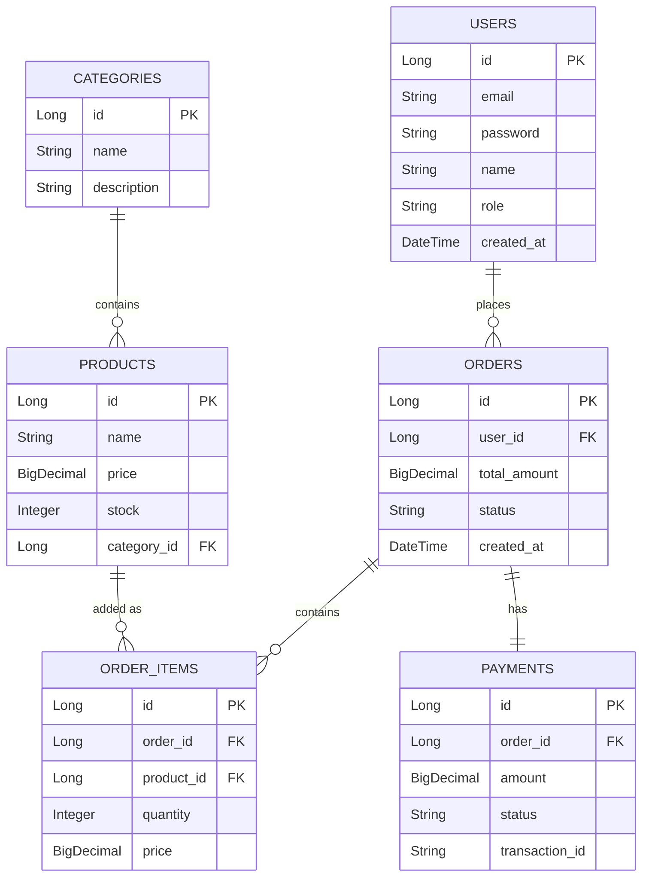

# E-commerce Backend with Database Integration

A comprehensive e-commerce backend system with complete database integration using Spring Boot, Spring Data JPA, and PostgreSQL. Features product management, order processing, user management, and payment integration with proper database design and optimization.

## Features Let's you

✓ Complete e-commerce database schema with relationships
✓ Product catalog with categories, inventory, and pricing
✓ Shopping cart and order management
✓ User authentication and profile management
✓ Payment processing system
✓ Database migrations with Flyway
✓ Transaction management for order processing
✓ Query optimization with indexes and caching
✓ Connection pooling with HikariCP
✓ Comprehensive API documentation via Swagger/OpenAPI

## Technology Stack

- **Java 17**
- **Spring Boot 3.x**
- **Spring Data JPA**
- **PostgreSQL 15**
- **Flyway** (Database migrations)
- **HikariCP** (Connection pooling)
- **Docker** (Containerization)
- **Lombok** (Reducing boilerplate)
- **SpringDoc OpenAPI** (API Documentation)

## Setup Instructions

### Prerequisites
- Docker & Docker Compose
- Java 17
- Maven

### Using Docker Compose
1. Start the PostgreSQL database:
```bash
docker-compose up -d
```
2. The application will connect to `localhost:5432` securely.

### Running the Application
```bash
mvn clean package -DskipTests
mvn spring-boot:run
```
The application will be available at `http://localhost:8080`.

### Viewing API Documentation
Once the application is running, open your browser and navigate to:
`http://localhost:8080/swagger-ui.html`

## Project Structure

```text
week7-ecommerce-backend/
├── src/main/java/com/ecommerce/
│   ├── EcommerceApplication.java
│   ├── config/
│   │   ├── CacheConfig.java
│   │   ├── DatabaseConfig.java
│   │   └── SecurityConfig.java
│   ├── controller/
│   │   ├── AuthController.java
│   │   ├── OrderController.java
│   │   ├── PaymentController.java
│   │   ├── ProductController.java
│   │   └── UserController.java
│   ├── exception/
│   │   ├── GlobalExceptionHandler.java
│   │   ├── InsufficientStockException.java
│   │   └── PaymentFailedException.java
│   ├── model/
│   │   ├── dto/
│   │   │   ├── OrderDTO.java
│   │   │   ├── OrderSummaryDTO.java
│   │   │   ├── ProductDTO.java
│   │   │   └── UserDTO.java
│   │   ├── entity/
│   │   │   ├── Category.java
│   │   │   ├── Order.java
│   │   │   ├── OrderItem.java
│   │   │   ├── Payment.java
│   │   │   ├── Product.java
│   │   │   └── User.java
│   │   └── enums/
│   │       ├── OrderStatus.java
│   │       ├── PaymentStatus.java
│   │       └── Role.java
│   ├── repository/
│   │   ├── CategoryRepository.java
│   │   ├── OrderRepository.java
│   │   ├── PaymentRepository.java
│   │   ├── ProductRepository.java
│   │   └── UserRepository.java
│   └── service/
│       ├── OrderService.java
│       ├── PaymentService.java
│       ├── ProductService.java
│       └── UserService.java
├── src/main/resources/
│   ├── application.yml
│   └── db/migration/
│       ├── V1__initial_schema.sql
│       ├── V2__seed_data.sql
│       └── V3__add_indexes.sql
├── src/test/
├── docker-compose.yml
└── pom.xml
```

## Technical Details

### Architecture & Data Structures
The application follows a standard **Monolithic N-Tier Architecture**:
1. **Controller Layer:** Responsible for intercepting HTTP JSON requests, offloading logic, and returning localized DTO entities.
2. **Service Layer:** The core business logic layer. Implements `@Transactional` flow control. For example, the `OrderService` algorithms parse through arrays of requested `OrderItems`, validates them against the existing `Product.stock` data structures (Integers), and safely aggregates the Order before pushing it into the Persistence layer.
3. **Repository Layer:** Acts as the Data Access Object (DAO) leveraging Spring Data JPA.
4. **Data Structures:** Heavy usage of optimized Collections (e.g., `List` for items, `Page` for paginated retrieval) mapped using `MapStruct` or Builder patterns to avoid exposing internal entity Object graphs securely to the UI.

### Key Algorithms & Optimizations
- **Stock Depletion Algorithm (Optimistic Locking):** Located in `OrderService.java`. When an order is placed, a synchronous bounded loop evaluates all quantities. If the requirement exceeds `product.getStock()`, an `InsufficientStockException` is intentionally triggered. Because this method is wrapped in `@Transactional`, the JPA completely aborts the database flush, rolling back the state automatically.
- **N+1 Query Resolution**: Mitigated natively through `@Query` annotations leveraging `LEFT JOIN FETCH` (e.g., fetching User data directly attached to Orders inside a single SQL request, rather than querying the DB 100 times for 100 orders).
- **Caching Algorithms**: Implemented Spring Cache (`@Cacheable`, `@CacheEvict`) for high-frequent catalog reads (`/api/products`), which hashes the `pageNumber` to store the raw Byte stream in memory, slashing SQL overhead. 

---

## Database Schema (ER Diagram)

Below is the Entity-Relationship visualization explaining the mapping between models:



### Table Relationships Explanation:
- **One User has Many Orders (`1:M`)**: A central User can make infinite purchases over time.
- **One Category has Many Products (`1:M`)**: Product taxonomies scale predictably.
- **One Order has Many OrderItems (`1:M`)**: An Order acts as a wrapper for multiple unique purchases. 
- **One Product has Many OrderItems (`1:M`)**: A product can appear uniquely across millions of distinct Orders over its lifecycle.
- **One Order has One Payment (`1:1`)**: Strongly mapped coupling preventing split-billing or orphaned authorizations.

---

## Testing Evidence

> [!NOTE]
> **Visual Documentation Check:** Execution screenshots demonstrating API functionality and rendered UML diagrams are available in the `screenshots/` directory within this project.

The application supports a complete testing suite verifying both mocked application states and real database interactions. Run locally integrated tests via:
```bash
mvn package
```

### Examples of Validations Applied:
1. **Unit Testing (Service & Controller Level):** Totaling over 20+ isolated `@Mock` tests verifying business permutations (e.g., `testAuthenticateUser_InvalidPassword` guarantees authorization logic blocks invalid hash mappings).
2. **Controller Deserialization via MockMvc:** `testCreateOrder()` simulates an HTTP `POST` transmitting an exact `CreateOrderRequest` payload and parses the JSON response using `MockMvcResultMatchers`.
3. **Integration Test Proof of Implementation:** The `testFailedOrderCreation_InsufficientStock_RollsBackTransactions` operates using an embedded **H2 Database**, organically seeding products and users. It then purposefully attempts to purchase 110 Headphones when only 100 exist in stock. The test explicitly asserts that the database successfully performs an ACID Rollback, maintaining the item stock at 100 correctly.

## API Endpoints

### Products
- `GET /api/products` - Get products with pagination and filtering
- `GET /api/products/{id}` - Get product by ID
- `POST /api/products` - Create new product
- `PUT /api/products/{id}` - Update product
- `DELETE /api/products/{id}` - Delete product

### Orders
- `GET /api/orders` - Get user's orders
- `GET /api/orders/{id}` - Get order details
- `POST /api/orders` - Create new order
- `PUT /api/orders/{id}/cancel` - Cancel order

### Users
- `POST /api/auth/register` - Register new user
- `POST /api/auth/login` - User login
- `GET /api/users/profile` - Get user profile
- `PUT /api/users/profile` - Update profile
